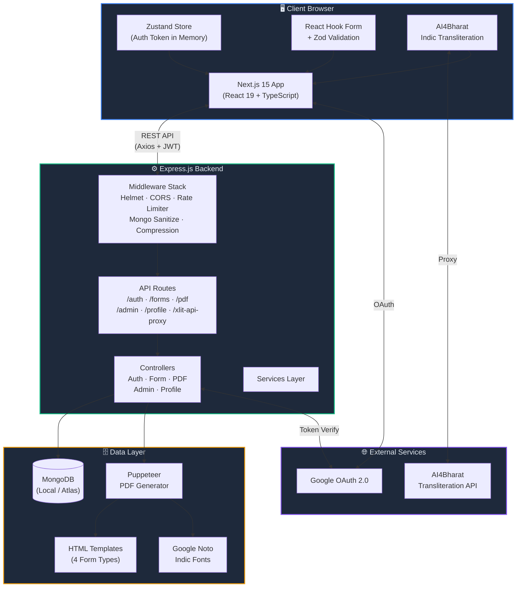
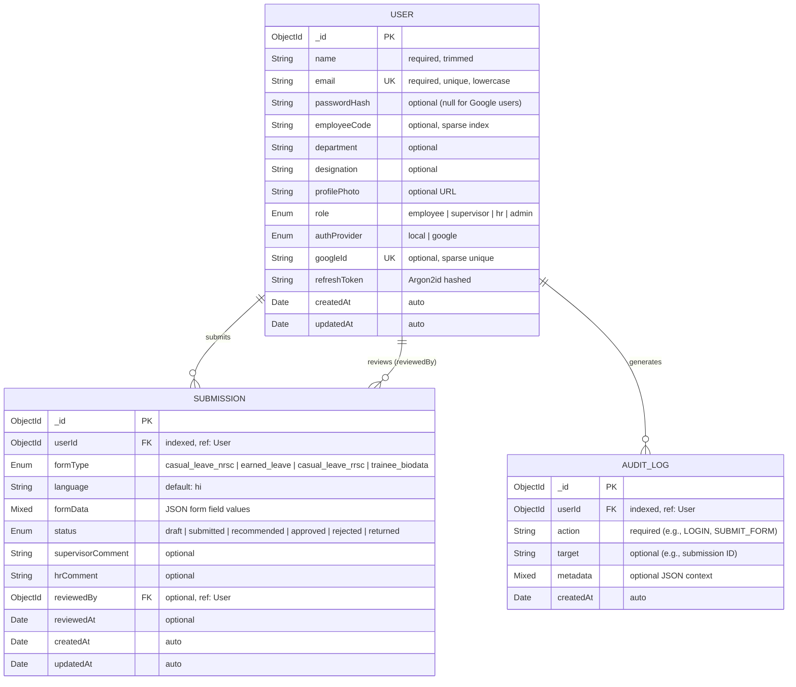
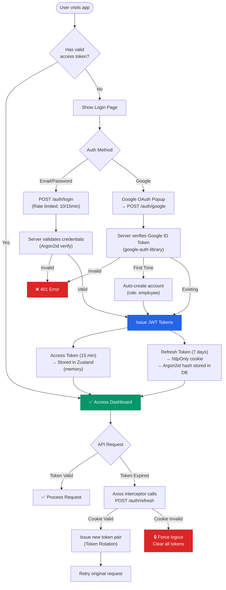
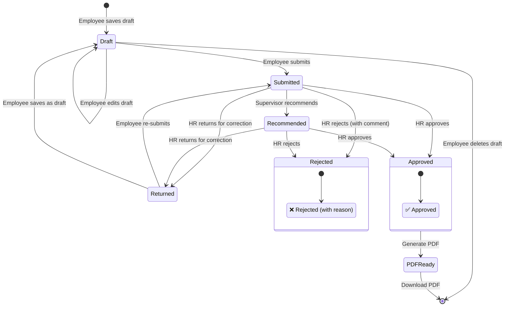
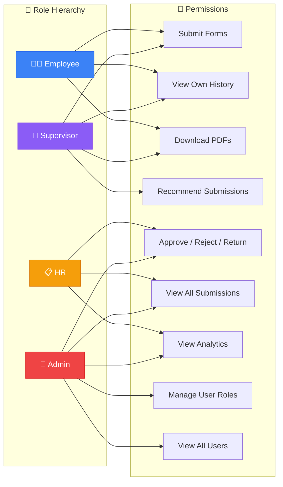
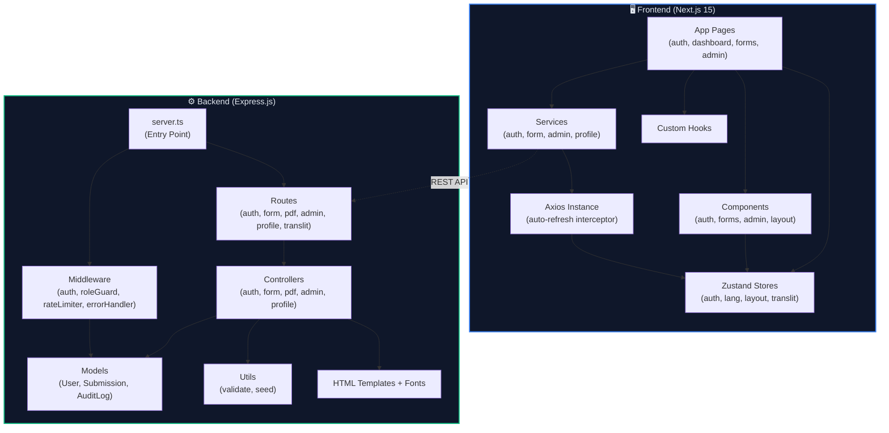
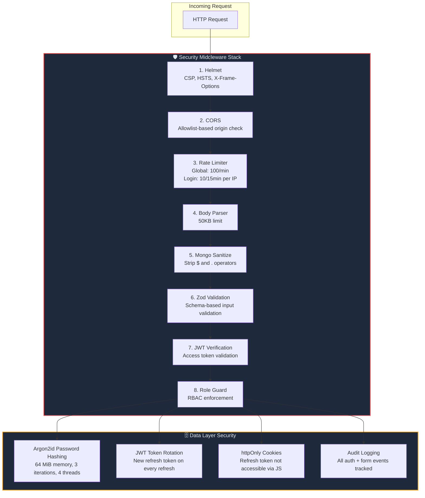

# 🛰️ NRSC Smart Leave Management System (SLMS)

<div align="center">


**A production-ready, bilingual, enterprise-grade Leave & Form Management System for ISRO – National Remote Sensing Centre (NRSC) and Regional Remote Sensing Centre – West (RRSC-W).**

[Features](#-features) · [Architecture](#-system-architecture) · [Quick Start](#-quick-start-clone--run) · [API Reference](#-api-reference) · [Tech Stack](#️-tech-stack)

</div>

---

## 📋 Table of Contents

- [Overview](#-overview)
- [Features](#-features)
- [Tech Stack](#️-tech-stack)
- [System Architecture](#-system-architecture)
- [Database Schema](#-database-schema-erd)
- [Authentication Flow](#-authentication-flow)
- [Form Submission Workflow](#-form-submission-workflow)
- [Project Structure](#-project-structure)
- [Quick Start: Clone & Run](#-quick-start-clone--run)
- [Environment Variables](#-environment-variables)
- [Default Accounts](#-default-accounts)
- [API Reference](#-api-reference)
- [Available Forms](#-available-forms)
- [Supported Languages](#-supported-languages-transliteration)
- [Security Architecture](#-security-architecture)
- [Available Scripts](#️-available-scripts)
- [Troubleshooting](#-troubleshooting)
- [Production Deployment](#-production-deployment)
- [License](#-license)

---

## 🔍 Overview

NRSC SLMS digitises the paper-based leave and biodata forms used across NRSC and RRSC-W campuses. Employees fill forms in their preferred Indian language (with live Indic transliteration support for 10 languages), HR/Admin review and approve submissions through a role-based workflow, and the system generates print-ready PDFs with embedded Google Noto Indic fonts.

### Key Highlights

- 🌐 **Bilingual UI** — Hindi (default) + English interface with real-time language switching
- 🔤 **10-Language Transliteration** — Type in English phonetics, get output in Hindi, Marathi, Bengali, Tamil, Telugu, Gujarati, Kannada, Malayalam, Punjabi, or Odia
- 📄 **Pixel-Perfect PDFs** — Puppeteer + Google Noto fonts generate A4 PDFs identical to the original government forms
- 🔒 **Enterprise Security** — Argon2id hashing, JWT rotation, rate limiting, NoSQL injection protection
- 👥 **4-Tier Role System** — Employee → Supervisor → HR → Admin with granular access control

---

## ✨ Features

| Category | Highlights |
|----------|------------|
| **Authentication** | Email/password (Argon2id) + Google OAuth, JWT rotation, httpOnly cookies |
| **Forms** | 4 bilingual forms with live Indic transliteration (10 languages) |
| **PDF Generation** | Puppeteer + Google Noto fonts — pixel-perfect A4 PDFs |
| **Workflow** | Draft → Submit → HR Review (Approve / Reject / Return) |
| **Dashboard** | Real-time stats, submission history, pagination |
| **Analytics** | Monthly trends, status breakdown, form-type breakdown (Admin) |
| **Role-Based Access** | Employee · Supervisor · HR · Admin |
| **Security** | Helmet, CORS, rate limiting, NoSQL injection protection, Zod validation |
| **Bilingual** | Hindi (default) + English UI, 10-language transliteration |

---

## 🛠️ Tech Stack

### Frontend

| Technology | Version | Purpose |
|------------|---------|---------|
| [Next.js](https://nextjs.org) | 15.0.0 | React framework with App Router |
| [React](https://react.dev) | 19.0.0 | UI library |
| TypeScript | ^5.3 | Static typing |
| Tailwind CSS | ^3.4 | Utility-first CSS |
| [Zustand](https://zustand-demo.pmnd.rs) | ^4.5 | Lightweight global state (access token in memory) |
| [React Hook Form](https://react-hook-form.com) | ^7.51 | Performant form handling |
| [Zod](https://zod.dev) | ^3.23 | Schema validation |
| [Axios](https://axios-http.com) | ^1.7 | HTTP client with auto token-refresh interceptor |
| [Recharts](https://recharts.org) | ^2.12 | Analytics charts |
| [Lucide React](https://lucide.dev) | ^0.400 | Icon library |
| [@ai4bharat/indic-transliterate](https://github.com/AI4Bharat/indic-transliterate) | ^1.3.8 | Live Indic transliteration |
| [@react-oauth/google](https://github.com/MomenSherif/react-oauth) | ^0.12 | Google OAuth button |

### Backend

| Technology | Version | Purpose |
|------------|---------|---------|
| [Express.js](https://expressjs.com) | ^4.19 | REST API server |
| TypeScript | ^5.4 | Static typing |
| [Mongoose](https://mongoosejs.com) | ^8.4 | MongoDB ODM |
| [Argon2](https://github.com/ranisalt/node-argon2) | ^0.31 | Password hashing (Argon2id) |
| [jsonwebtoken](https://github.com/auth0/node-jsonwebtoken) | ^9.0 | JWT access + refresh tokens |
| [google-auth-library](https://github.com/googleapis/google-auth-library-nodejs) | ^9.11 | Google ID token verification |
| [Puppeteer](https://pptr.dev) | ^22.10 | Headless Chrome PDF generation |
| [Helmet](https://helmetjs.github.io) | ^7.1 | Security headers |
| [express-rate-limit](https://github.com/express-rate-limit/express-rate-limit) | ^7.3 | Rate limiting |
| [express-mongo-sanitize](https://github.com/fiznool/express-mongo-sanitize) | ^2.2 | NoSQL injection protection |
| [Zod](https://zod.dev) | ^3.23 | Request validation schemas |
| [compression](https://github.com/expressjs/compression) | ^1.7 | Gzip response compression |

### Database

| Technology | Details |
|------------|---------|
| MongoDB | Local: `mongodb://127.0.0.1:27017/nrsc_slms` |
| MongoDB Atlas | Cloud: `mongodb+srv://...` (for production) |
| Mongoose ODM | Models: User, Submission, AuditLog |

---

## 🏗 System Architecture

### High-Level Architecture



### Request-Response Flow

```mermaid
sequenceDiagram
    participant B as Browser
    participant N as Next.js Frontend
    participant A as Axios Interceptor
    participant M as Middleware Stack
    participant C as Controller
    participant DB as MongoDB

    B->>N: User Action (Click / Submit)
    N->>A: API Request
    A->>A: Attach Bearer Token<br/>(from Zustand memory store)
    A->>M: HTTP Request + JWT

    rect rgb(30, 41, 59)
        Note over M: Middleware Pipeline
        M->>M: 1. Helmet (Security Headers)
        M->>M: 2. CORS Check
        M->>M: 3. Rate Limiter
        M->>M: 4. Body Parser
        M->>M: 5. Mongo Sanitize
        M->>M: 6. JWT Verify
        M->>M: 7. Role Guard
    end

    M->>C: Validated Request
    C->>DB: Query / Mutation
    DB-->>C: Result
    C-->>M: JSON Response
    M-->>A: HTTP Response

    alt 401 Unauthorized (Token Expired)
        A->>M: POST /auth/refresh (httpOnly cookie)
        M-->>A: New Access Token
        A->>A: Update Zustand Store
        A->>M: Retry Original Request
        M-->>A: Success Response
    end

    A-->>N: Response Data
    N-->>B: Updated UI
```



---

## 📊 Database Schema (ERD)



### Collection Indexes

| Collection | Index | Type | Purpose |
|------------|-------|------|---------|
| `users` | `email` | Unique | Fast lookup by email |
| `users` | `googleId` | Sparse Unique | Google OAuth lookup |
| `users` | `employeeCode` | Sparse | Employee code search |
| `submissions` | `userId` | Regular | User's submissions |
| `submissions` | `formType` | Regular | Filter by form type |
| `submissions` | `status` | Regular | Filter by status |
| `auditlogs` | `userId` | Regular | User activity trail |

---

## 🔐 Authentication Flow



---

## 📝 Form Submission Workflow



### Role-Based Permissions Matrix



---

## 📁 Project Structure

```
nrsc-slms/
├── backend/
│   ├── src/
│   │   ├── config/
│   │   │   └── db.ts                  # MongoDB connection
│   │   ├── controllers/
│   │   │   ├── authController.ts      # Register, Login, Google OAuth, Refresh, Logout
│   │   │   ├── formController.ts      # Draft, Submit, History, Stats
│   │   │   ├── pdfController.ts       # PDF generation (Puppeteer)
│   │   │   ├── adminController.ts     # Approve/Reject/Return, Analytics, Users
│   │   │   └── profileController.ts   # Get/Update profile
│   │   ├── middleware/
│   │   │   ├── auth.ts                # JWT verifyToken middleware
│   │   │   ├── errorHandler.ts        # Global Express error handler
│   │   │   ├── rateLimiter.ts         # Global (100/min) + Login (10/15min) limiters
│   │   │   └── roleGuard.ts           # Role-based access control
│   │   ├── models/
│   │   │   ├── User.ts                # User schema (roles, authProvider, refreshToken)
│   │   │   ├── Submission.ts          # Form submission schema
│   │   │   └── AuditLog.ts            # Audit trail schema
│   │   ├── routes/
│   │   │   ├── authRoutes.ts          # /api/auth/*
│   │   │   ├── formRoutes.ts          # /api/forms/*
│   │   │   ├── pdfRoutes.ts           # /api/pdf/*
│   │   │   ├── adminRoutes.ts         # /api/admin/*
│   │   │   ├── profileRoutes.ts       # /api/profile/*
│   │   │   └── translitRoutes.ts      # /api/xlit-api-proxy/*
│   │   ├── services/                  # Business logic layer
│   │   ├── templates/                 # HTML form templates (4 forms)
│   │   │   ├── casual_leave_nrsc.html
│   │   │   ├── casual_leave_rrsc.html
│   │   │   ├── earned_leave.html
│   │   │   └── trainee_biodata.html
│   │   ├── fonts/                     # Google Noto Indic TTF fonts
│   │   ├── types/                     # TypeScript type definitions
│   │   ├── utils/
│   │   │   ├── validate.ts            # Zod schemas for all endpoints
│   │   │   └── seed.ts                # Database seeder (default accounts)
│   │   └── server.ts                  # App entry point
│   ├── .env.example                   # Environment variable template
│   ├── copy-assets.js                 # Build script (copies templates & fonts to dist/)
│   ├── nodemon.json                   # Nodemon config (watches src/ only)
│   ├── tsconfig.json
│   └── package.json
│
├── frontend/
│   ├── src/
│   │   ├── app/
│   │   │   ├── (auth)/
│   │   │   │   ├── login/             # Login page
│   │   │   │   └── register/          # Registration page
│   │   │   ├── (dashboard)/
│   │   │   │   ├── dashboard/         # Employee dashboard
│   │   │   │   ├── forms/             # Form pages (4 forms)
│   │   │   │   ├── history/           # Submission history
│   │   │   │   ├── profile/           # User profile
│   │   │   │   └── admin/             # HR/Admin panel
│   │   │   ├── splash/                # Splash/landing page
│   │   │   ├── globals.css            # Global styles + Tailwind
│   │   │   ├── layout.tsx             # Root layout
│   │   │   └── page.tsx               # Entry redirect
│   │   ├── components/
│   │   │   ├── Providers.tsx          # GoogleOAuthProvider + session restore
│   │   │   ├── auth/                  # LoginForm, RegisterForm, GuestGuard
│   │   │   ├── dashboard/             # Stats cards, charts
│   │   │   ├── forms/                 # Form components
│   │   │   ├── admin/                 # Admin review UI
│   │   │   ├── common/                # Shared UI components
│   │   │   ├── history/               # Submission history components
│   │   │   └── layout/                # Sidebar, Header
│   │   ├── hooks/                     # Custom React hooks
│   │   ├── lib/
│   │   │   └── axios.ts               # Axios instance + 401 auto-refresh interceptor
│   │   ├── services/
│   │   │   ├── authService.ts         # Auth API calls
│   │   │   ├── formService.ts         # Form API calls
│   │   │   ├── adminService.ts        # Admin API calls
│   │   │   └── profileService.ts      # Profile API calls
│   │   ├── store/
│   │   │   ├── useAuthStore.ts        # Zustand auth store (token in memory)
│   │   │   ├── useLangStore.ts        # Language/i18n store
│   │   │   ├── useLayoutStore.ts      # Sidebar/layout state
│   │   │   └── useTranslitStore.ts    # Transliteration settings
│   │   └── types/                     # Shared TypeScript interfaces
│   ├── public/                        # Static assets
│   ├── .env.local.example             # Frontend env template
│   ├── next.config.ts                 # Next.js configuration
│   ├── tailwind.config.ts             # Tailwind CSS configuration
│   └── package.json
│
├── .gitignore
└── README.md
```

### Module Dependency Diagram



---

## 🚀 Quick Start: Clone & Run

### Prerequisites

Before starting, ensure you have the following installed on your machine:

| Tool | Version | Download Link |
|------|---------|---------------|
| **Node.js** | ≥ 18.x (LTS recommended) | [https://nodejs.org](https://nodejs.org) |
| **npm** | ≥ 9.x (bundled with Node.js) | — |
| **MongoDB Community Server** | ≥ 7.x | [https://www.mongodb.com/try/download/community](https://www.mongodb.com/try/download/community) |
| **Git** | Any recent version | [https://git-scm.com](https://git-scm.com) |
| **Google Chrome** | Any (for Puppeteer PDF generation) | [https://www.google.com/chrome](https://www.google.com/chrome) |

> 💡 **Tip**: You can verify installations with `node -v`, `npm -v`, `mongod --version`, and `git --version`.

---

### Step 1 — Clone the Repository

```bash
git clone https://github.com/<your-username>/nrsc-slms.git
cd nrsc-slms
```

---

### Step 2 — Start MongoDB

MongoDB must be running locally before starting the backend.

<details>
<summary><strong>🪟 Windows</strong></summary>

**Option A — MongoDB as a Windows Service (recommended)**
```bash
# If MongoDB was installed as a service during setup:
net start MongoDB
```

**Option B — Run mongod manually**
```bash
# Create data directory if it doesn't exist
mkdir C:\data\db

# Start MongoDB server
mongod --dbpath "C:\data\db"
```

> Leave this terminal open — MongoDB runs in the foreground.

</details>

<details>
<summary><strong>🍎 macOS</strong></summary>

```bash
# Using Homebrew
brew services start mongodb-community

# Or run manually
mongod --dbpath /usr/local/var/mongodb
```

</details>

<details>
<summary><strong>🐧 Linux (Ubuntu/Debian)</strong></summary>

```bash
# Start MongoDB service
sudo systemctl start mongod

# Enable auto-start on boot
sudo systemctl enable mongod

# Verify it's running
sudo systemctl status mongod
```

</details>

> ✅ Verify MongoDB is running: `mongosh` should connect successfully to `mongodb://127.0.0.1:27017`.

---

### Step 3 — Backend Setup

```bash
# Navigate to backend directory
cd backend

# Install all dependencies
npm install
```

#### Configure Environment Variables

```bash
# Copy the example environment file
# Windows (CMD)
copy .env.example .env

# macOS / Linux
cp .env.example .env
```

Open `backend/.env` in your editor and fill in the values:

```env
PORT=5000
MONGODB_URI=mongodb://127.0.0.1:27017/nrsc_slms
JWT_ACCESS_SECRET=<generate-a-64-char-hex-string>
JWT_REFRESH_SECRET=<generate-a-different-64-char-hex-string>
JWT_ACCESS_EXPIRY=15m
JWT_REFRESH_EXPIRY=7d
GOOGLE_CLIENT_ID=your-google-client-id-here
CLIENT_URL=http://localhost:3000
NODE_ENV=development
```

> **Generate JWT secrets** using:
> ```bash
> node -e "console.log(require('crypto').randomBytes(32).toString('hex'))"
> ```
> Run this command **twice** — one for `JWT_ACCESS_SECRET` and one for `JWT_REFRESH_SECRET`.

#### Start the Backend Server

```bash
npm run dev
```

You should see:
```
✅ NRSC SLMS Server — http://localhost:5000 [development]
```

#### Seed the Database (First Time Only)

Open a **new terminal** and run:

```bash
cd backend
npm run seed
```

This creates 4 default user accounts (see [Default Accounts](#-default-accounts)).

---

### Step 4 — Frontend Setup

Open a **new terminal** window:

```bash
# Navigate to frontend directory
cd frontend

# Install all dependencies
npm install
```

#### Configure Frontend Environment

```bash
# Windows (CMD)
copy .env.local.example .env.local

# macOS / Linux
cp .env.local.example .env.local
```

Open `frontend/.env.local` and verify:

```env
NEXT_PUBLIC_API_URL=http://localhost:5000/api
NEXT_PUBLIC_GOOGLE_CLIENT_ID=your-google-client-id-here
```

#### Start the Frontend Dev Server

```bash
npm run dev
```

You should see:
```
▲ Next.js 15.0.0
- Local: http://localhost:3000
```

---

### Step 5 — Open in Browser

Navigate to **http://localhost:3000** and log in with one of the [default accounts](#-default-accounts).

> 📌 **Summary of running services:**
> | Service | URL | Terminal |
> |---------|-----|----------|
> | MongoDB | `mongodb://127.0.0.1:27017` | Terminal 1 |
> | Backend API | `http://localhost:5000` | Terminal 2 |
> | Frontend App | `http://localhost:3000` | Terminal 3 |

---

### Step 6 — Install Puppeteer Chromium (If PDF Fails)

If PDF generation fails, install Chromium for Puppeteer:

```bash
cd backend
npx puppeteer browsers install chrome
```

---

## 🔐 Environment Variables

### `backend/.env`

| Variable | Required | Default | Description |
|----------|----------|---------|-------------|
| `PORT` | No | `5000` | Backend server port |
| `NODE_ENV` | No | `development` | `development` or `production` |
| `MONGODB_URI` | **Yes** | — | MongoDB connection string |
| `JWT_ACCESS_SECRET` | **Yes** | — | 64-char hex string for access tokens |
| `JWT_REFRESH_SECRET` | **Yes** | — | 64-char hex string for refresh tokens |
| `JWT_ACCESS_EXPIRY` | No | `15m` | Access token expiry duration |
| `JWT_REFRESH_EXPIRY` | No | `7d` | Refresh token expiry duration |
| `GOOGLE_CLIENT_ID` | No | — | Google OAuth Client ID (leave empty to disable) |
| `CLIENT_URL` | **Yes** | — | Comma-separated frontend origins for CORS |

### `frontend/.env.local`

| Variable | Required | Default | Description |
|----------|----------|---------|-------------|
| `NEXT_PUBLIC_API_URL` | **Yes** | — | Backend API base URL (e.g., `http://localhost:5000/api`) |
| `NEXT_PUBLIC_GOOGLE_CLIENT_ID` | No | — | Google OAuth Client ID (leave empty to hide Google login button) |

---

## 👤 Default Accounts

After running `npm run seed` in the backend directory:

| Role | Email | Password | Access Level |
|------|-------|----------|-------------|
| **Admin** | `admin@isro.gov.in` | `Password@123` | Full system access, user role management |
| **HR** | `hr@isro.gov.in` | `Password@123` | Review all submissions, approve/reject/return |
| **Supervisor** | `supervisor@isro.gov.in` | `Password@123` | View submissions, recommend approval |
| **Employee** | `employee@isro.gov.in` | `Password@123` | Submit forms, view own history, download PDFs |

> ⚠️ **Change these passwords** before deploying to production.

---

## 📡 API Reference

### Authentication — `/api/auth`

| Method | Endpoint | Auth | Body | Description |
|--------|----------|------|------|-------------|
| `POST` | `/auth/register` | ❌ | `name, email, password` | Register new account |
| `POST` | `/auth/login` | ❌ | `email, password` | Login (rate limited: 10/15min) |
| `POST` | `/auth/google` | ❌ | `credential` | Google OAuth login |
| `POST` | `/auth/refresh` | Cookie | — | Refresh access token |
| `POST` | `/auth/logout` | Cookie | — | Logout & clear session |

### Forms — `/api/forms` _(requires Bearer token)_

| Method | Endpoint | Description |
|--------|----------|-------------|
| `GET` | `/forms/stats` | Dashboard stats (total/approved/pending/rejected) |
| `POST` | `/forms/draft` | Save a draft form |
| `POST` | `/forms/submit` | Submit a form for HR review |
| `GET` | `/forms/history` | Paginated submission history |
| `GET` | `/forms/:id` | Get single submission |
| `PUT` | `/forms/:id` | Update a draft |
| `DELETE` | `/forms/:id` | Delete a draft |

### PDF — `/api/pdf` _(requires Bearer token)_

| Method | Endpoint | Description |
|--------|----------|-------------|
| `GET` | `/pdf/:submissionId` | Download submission as PDF |

### Admin — `/api/admin` _(requires HR or Admin role)_

| Method | Endpoint | Description |
|--------|----------|-------------|
| `GET` | `/admin/submissions` | All submissions (filterable, paginated) |
| `PATCH` | `/admin/submissions/:id/approve` | Approve a submission |
| `PATCH` | `/admin/submissions/:id/reject` | Reject with mandatory comment |
| `PATCH` | `/admin/submissions/:id/return` | Return for correction |
| `GET` | `/admin/analytics` | Monthly + status + form-type analytics |
| `GET` | `/admin/users` | All registered users |
| `PATCH` | `/admin/users/:id/role` | Update user role _(Admin only)_ |

### Profile — `/api/profile` _(requires Bearer token)_

| Method | Endpoint | Description |
|--------|----------|-------------|
| `GET` | `/profile` | Get current user profile |
| `PATCH` | `/profile` | Update name, employeeCode, department, designation |

### Health Check

| Method | Endpoint | Description |
|--------|----------|-------------|
| `GET` | `/api/health` | Server health check |

---

## 📄 Available Forms

| # | Form Name | Organisation | Form Type Key |
|---|-----------|-------------|---------------|
| 1 | Casual Leave Application | NRSC | `casual_leave_nrsc` |
| 2 | Earned Leave / Extension of Leave | NRSC | `earned_leave` |
| 3 | Casual / Special CL / Compensatory Off | RRSC-W | `casual_leave_rrsc` |
| 4 | Trainee Bio-Data Form | RRSC-W | `trainee_biodata` |

All forms support **live Indic transliteration** while typing in English phonetics.

---

## 🌐 Supported Languages (Transliteration)

| Language | Script | Example Input → Output |
|----------|--------|------------------------|
| Hindi | Devanagari | `namaste` → `नमस्ते` |
| Marathi | Devanagari | `namaskar` → `नमस्कार` |
| Bengali | Bengali | `namaskar` → `নমস্কার` |
| Gujarati | Gujarati | `namaste` → `નમસ્તે` |
| Tamil | Tamil | `vanakkam` → `வணக்கம்` |
| Telugu | Telugu | `namaskaram` → `నమస్కారం` |
| Kannada | Kannada | `namaskara` → `ನಮಸ್ಕಾರ` |
| Malayalam | Malayalam | `namasthe` → `നമസ്തേ` |
| Punjabi | Gurmukhi | `sat sri akal` → `ਸਤ ਸ੍ਰੀ ਅਕਾਲ` |
| Odia | Odia | `namaskar` → `ନମସ୍କାର` |

---

## 🔒 Security Architecture



| Layer | Mechanism |
|-------|-----------|
| **Password Hashing** | Argon2id (64 MiB memory, 3 iterations, 4 threads) |
| **Access Token** | JWT — short-lived (15 min), stored in memory only |
| **Refresh Token** | JWT — long-lived (7 days), httpOnly cookie + Argon2id hash in DB |
| **Token Rotation** | New refresh token issued on every `/auth/refresh` call |
| **CORS** | Allowlist-based; all localhost ports in dev, strict origin in prod |
| **Rate Limiting** | Global: 100 req/min · Login: 10 attempts/15 min (per IP) |
| **Input Validation** | Zod schemas on every endpoint — malformed requests rejected with 400 |
| **NoSQL Injection** | `express-mongo-sanitize` strips `$` and `.` from all inputs |
| **Security Headers** | Helmet (CSP, HSTS, X-Frame-Options, etc.) |
| **Audit Logging** | All auth events and form actions written to AuditLog collection |

---

## 🛠️ Available Scripts

### Backend (`cd backend`)

```bash
npm run dev          # Start dev server with hot-reload (nodemon + ts-node)
npm run build        # Compile TypeScript + copy HTML templates & fonts to dist/
npm run start        # Run compiled production build
npm run seed         # Populate DB with 4 default user accounts
npm run type-check   # TypeScript type check (no emit)
npm run lint         # ESLint check
```

### Frontend (`cd frontend`)

```bash
npm run dev          # Start Next.js dev server (http://localhost:3000)
npm run build        # Production build
npm run start        # Run production build
npm run type-check   # TypeScript type check
npm run lint         # Next.js ESLint check
```

---

## 🐛 Troubleshooting

### ❌ `EADDRINUSE: address already in use :::5000`

Another process is already using port 5000.

```bash
# Windows — find and kill the process
netstat -ano | findstr :5000
taskkill /PID <PID> /F

# macOS / Linux
lsof -i :5000
kill -9 <PID>
```

### ❌ `MongoDB connection error` / cannot connect

Make sure MongoDB is running:

```bash
# Windows — start MongoDB service
net start MongoDB
# OR run mongod manually
mongod --dbpath "C:\data\db"

# macOS
brew services start mongodb-community

# Linux
sudo systemctl start mongod
```

### ❌ `AxiosError: Network Error` on login

1. Confirm backend is running at `http://localhost:5000`
2. Check `frontend/.env.local` has `NEXT_PUBLIC_API_URL=http://localhost:5000/api`
3. **Restart the frontend** after changing `.env.local` (Next.js requires a restart for env changes)

### ❌ CORS error in browser console

- Ensure `CLIENT_URL` in `backend/.env` includes the frontend origin (e.g., `http://localhost:3000`)
- The backend automatically allows all `localhost:*` ports when `NODE_ENV=development`

### ❌ `[GSI_LOGGER]: The given Client ID is not found`

This is a Google OAuth warning — **harmless**. To resolve:
- Set a real `NEXT_PUBLIC_GOOGLE_CLIENT_ID` from [Google Cloud Console](https://console.cloud.google.com)
- Or leave the placeholder — the Google login button is automatically hidden when not configured

### ❌ PDF download fails / blank PDF

1. Install Chromium for Puppeteer:
   ```bash
   npx puppeteer browsers install chrome
   ```
2. Ensure HTML templates exist in `backend/src/templates/`
3. Ensure Google Noto font files exist in `backend/src/fonts/`

### ❌ `npm install` fails with node-gyp errors (Argon2)

Argon2 requires native compilation. Install build tools:

```bash
# Windows
npm install -g windows-build-tools

# macOS
xcode-select --install

# Linux (Ubuntu/Debian)
sudo apt-get install build-essential python3
```

---

## 📦 Production Deployment

### Backend (Render / Railway / VPS)

1. Set all environment variables in your hosting dashboard
2. Set `NODE_ENV=production`
3. Set `MONGODB_URI` to your MongoDB Atlas connection string
4. Set `CLIENT_URL` to your frontend's production URL
5. Build and start:
   ```bash
   npm run build && npm start
   ```

### Frontend (Vercel)

1. Set `NEXT_PUBLIC_API_URL` to your backend's production URL
2. Set `NEXT_PUBLIC_GOOGLE_CLIENT_ID` if using Google login
3. Push to GitHub and connect to Vercel — it auto-deploys

---

## 📜 License

**Internal Use Only — ISRO / NRSC / RRSC-W**

This system is developed for internal government use within ISRO's National Remote Sensing Centre and Regional Remote Sensing Centres. Unauthorised distribution or external deployment is prohibited.

---

<div align="center">

Made with ❤️ for **ISRO — National Remote Sensing Centre (NRSC), Hyderabad**

</div>
